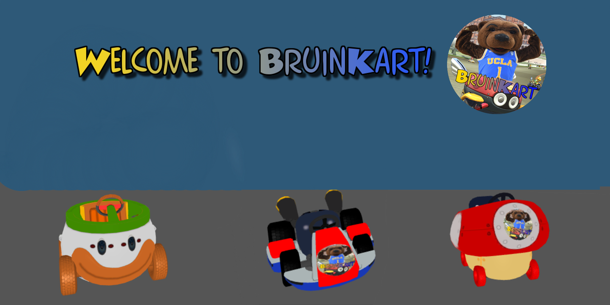

# BruinKart: UCLA's Mario Kart



## Description
Welcome to BruinKart! This is a project for UCLA's COM SCI 174A Final Project by Zane Witter, Jonathan Woo, and Pirjot Atwal. We intended to create a remake of the MarioKart series (specifically the GBA version) with a built in trial mode to play through!

The game is fitted with detailed modeling of karts, detailed map models, collision physics, an onscreen dynamic GUI, a working Ghost/Trial Mode, Racing Mechanics (and as of writing this README, we are working on implementing a working Skybox and Lighting system.)

## How to run
You can either run the host.bat file to run the server or directly run the server. Either of the following lines in a terminal that is the file will work:

```
./host.bat
python3 server.py
```

## Website
We are currently working on getting BruinKart up and running on a website for everyone to play!